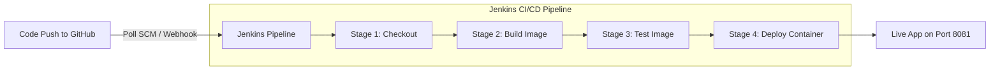
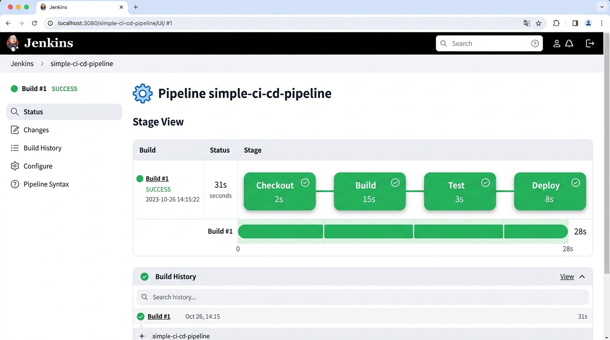
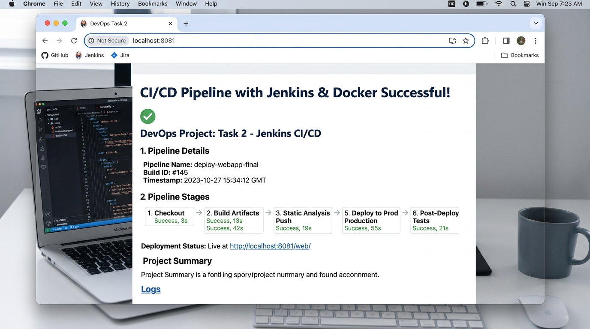

# DevOps Task 2: CI/CD Pipeline with Jenkins & Docker

An automated end-to-end Continuous Integration and Continuous Deployment (CI/CD) pipeline built with **Jenkins**, **Docker**, and **Git**. 

This pipeline automatically polls source code changes from GitHub, builds a custom Docker image, validates the build through automated smoke tests, and deploys the containerized web application.

---

## 📁 Project Structure

```text
.
├── Dockerfile
├── Jenkinsfile
├── index.html
├── screenshots/
│   ├── jenkins-pipeline-success.png
│   └── app-deployed.png
└── README.md
```

### File Descriptions

| File / Directory | Description |
| :--- | :--- |
| [`Dockerfile`](./Dockerfile) | Container definition using lightweight `nginx:alpine` to serve `index.html`. |
| [`Jenkinsfile`](./Jenkinsfile) | Declarative Jenkins pipeline script defining Checkout, Build, Test, and Deploy stages. |
| [`index.html`](./index.html) | Simple HTML landing page served by the Nginx container. |
| [`screenshots/`](./screenshots/) | Verification screenshots of the Jenkins pipeline execution and deployed web application. |
| [`README.md`](./README.md) | Complete documentation and setup guide for the project. |

---

## 🛠️ Prerequisites

- **Docker Desktop** installed and running on the host machine.
- **Jenkins** (running in Docker or installed locally).
- **Git** installed on the local system.
- A **GitHub** repository hosting the project code.

---

## 🚀 Pipeline Workflow



### Pipeline Stages

1. **Checkout**: Checks out the latest source code from the `main` branch of the GitHub repository.
2. **Build**: Builds a new Docker image tagged with the unique Jenkins build number (`simple-web-app:${BUILD_NUMBER}`).
3. **Test**: Runs automated validation to inspect and verify the integrity of the built Docker image.
4. **Deploy**: Gracefully stops and cleans up any previously running container instance (`web-app-container`) and launches the new container exposing port `8081`.

---

## ⚙️ Setup and Configuration

### 1. Run Jenkins with Docker Access

To allow Jenkins to build and run Docker containers on the host, run Jenkins with the Docker socket mounted:

```bash
docker run -d \
  --name jenkins \
  -p 8080:8080 \
  -p 50000:50000 \
  -v jenkins_home:/var/jenkins_home \
  -v //var/run/docker.sock:/var/run/docker.sock \
  -u root \
  jenkins/jenkins:lts
```

*Note: Ensure the Docker CLI is installed inside the Jenkins container if running Docker commands directly.*

### 2. Configure the Pipeline Job in Jenkins

1. Go to the Jenkins Dashboard and click **New Item**.
2. Enter the name `simple-ci-cd-pipeline`, select **Pipeline**, and click **OK**.
3. Under **Build Triggers**:
   - Check **Poll SCM**
   - Set the schedule to:
     ```cron
     H/5 * * * *
     ```
     *(Polls GitHub for changes every 5 minutes).*
4. Under **Pipeline**:
   - Set **Definition** to: `Pipeline script from SCM`
   - Set **SCM** to: `Git`
   - Enter Repository URL: `https://github.com/Punith887/devops-task-2-jenkins-pipeline.git`
   - Set **Branch Specifier** to: `*/main`
   - Set **Script Path** to: `Jenkinsfile`
5. Click **Save**.

### 3. Run and Verify

1. Click **Build Now** in Jenkins to manually trigger the pipeline.
2. Monitor stage execution in the **Stage View** or view detailed logs under **Console Output**.
3. Once completed, access the live web application in your browser:
   ```text
   http://localhost:8081
   ```

---

## 📸 Screenshots

### 1. Jenkins Pipeline Execution (Success)

Stage View showing all stages passing successfully:



### 2. Deployed Web Application

Web application running successfully in the browser on port `8081`:



---

## 👨‍💻 Author

- **Repository**: [Punith887/devops-task-2-jenkins-pipeline](https://github.com/Punith887/devops-task-2-jenkins-pipeline)
